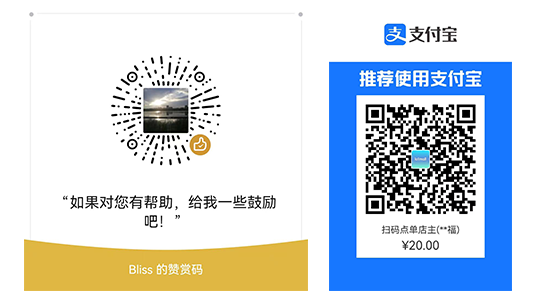

<div align="center">


<h1>baykeShop开源商城系统</h1>

</div>

## 项目简介

baykeShop（拜客商城系统）是一款全开源Python栈商城系统，后端依托django强大的框架体系，本项目融合了django的传统模版体系，同时轻微结合了前后端分离的开发方式，在不同场景选择了不同的技术栈，使其更具学习和研究价值，并且很好的打包为一个Python包文件，使其二次开发以及集成到自身项目更加简便易用，更是python django初学者开发上手学习的不二选择！

## 项目演示

商城PC端前台：http://s.bayke.shop

## 安装

```python
pip install baykeshop
```

## 配置

在项目settings.py中的最后引入

```python
# 开发时配置
from baykeshop.conf.develop import *

# 或者

# 部署时配置
from baykeshop.conf.production import *
```

特别说明：本项目覆盖了默认的admin进行了定制，需要将INSTALLED_APPS配置中默认的admin配置注释掉!

```
INSTALLED_APPS = [
    # 'django.contrib.admin',
]
```

## 项目urls.py中引入url

```python
urlpatterns = [
    path('admin/', admin.site.urls),
    # baykeshop的全部url
    path('', include("baykeshop.urls")),
]
```

## 迁移数据

```python
python manage.py makemigrations
python manage.py migrate
```

## 初始化必要数据

```python
python manage.py initdata
```

## 部署

部署方式多种多样，本项目作为一个包文件，将不会决定参与到你的部署过程当中，你可以根据你自身项目的需求以及django的官方文档来部署你的项目！

在部署过程中如果采用异步asgi的方式部署，可能会有异步安全类错误 `SynchronousOnlyOperation`，根据django官方文档给的提示和解决方案是在项目的settings.py中配置如下代码即可解决：

```python
import os
os.environ["DJANGO_ALLOW_ASYNC_UNSAFE"] = "true"
```

**特别说明**：项目配置中对缓存并没有特别配置，默认使用了django的内存缓存，部署时建议设置为reids缓存或者数据库缓存，否则邮件验证会有小问题！

## 配置说明

邮件配置以及支付宝配置均在后台的**系统分类**下的**广告内容**中配置，特别需要注意的是支付宝的应用私钥格式需要转换为PKCS1格式，可使用支付宝开放平台秘钥工具进行转换！DEBUG模式下支付宝默认为沙箱环境，部署时一定要关闭django的DEBUG模式，否则支付不能正确跳转！

# 赞赏支持

如果本项目对您有帮助，希望您能在能力范围之内给与支持，赞赏费用将用作项目的开发维护费用，以及演示站点的服务器费用支出！

凡赞赏金额大于20元的用户，可加入项目交流群与众多django开发爱好者在线交流，还可获得作者的在线答疑服务，以及后期相关配套插件的优先使用权！


